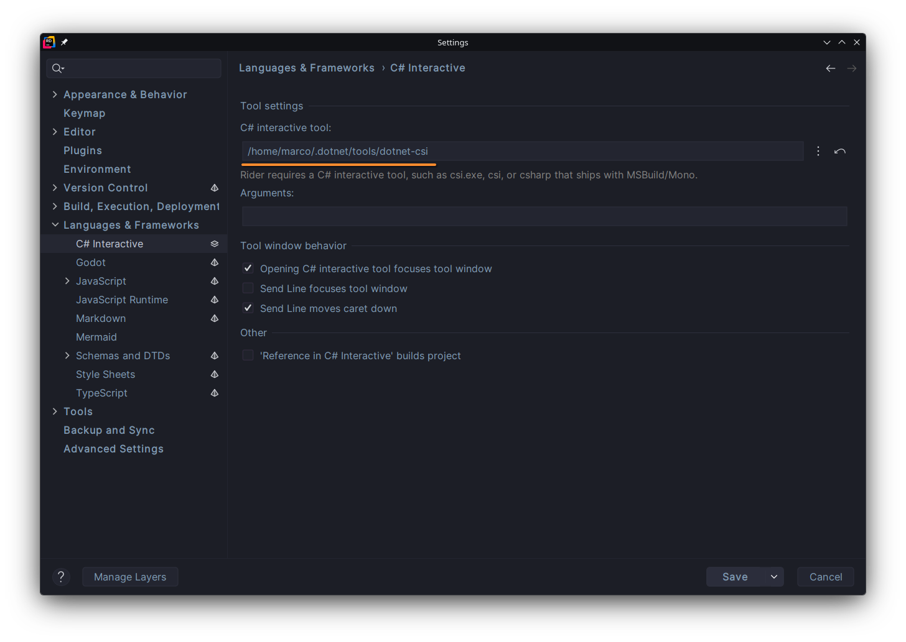
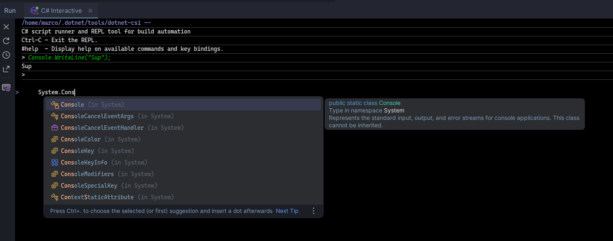

# JetBrains Rider Flatpak

> [!NOTE]
> Command examples below assume having Rider installed system-wide. If you're using a user installation instead, add `--user`.

## Setting up Dotnet

It is highly recommended to use the [.Net SDK extension provided by Flatpak](https://github.com/flathub/org.freedesktop.Sdk.Extension.dotnet10) instead of one installed from your package manager.
Using the host-installed SDK can cause problems due to misaligned dependencies, such as [breaking with system updates](https://github.com/flathub/com.jetbrains.Rider/issues/43).

To install the .Net SDK (choose the relevant versions):

```bash
> flatpak install flathub org.freedesktop.Sdk.Extension.dotnet8
> flatpak install flathub org.freedesktop.Sdk.Extension.dotnet9
> flatpak install flathub org.freedesktop.Sdk.Extension.dotnet10
> flatpak install flathub org.freedesktop.Sdk.Extension.dotnet11
```

> [!NOTE]
> As noted before, add `--user` if you're using a user installation, e.g. `flatpak install --user flathub org.freedesktop.Sdk.Extension.dotnet10`.

Then you need to enable the Flatpak extension by setting the `FLATPAK_ENABLE_SDK_EXT` environment variable to either `dotnet10` or `*`.

Enable all SDK extensions:

```bash
> flatpak override --env="FLATPAK_ENABLE_SDK_EXT=*" com.jetbrains.Rider
```

Enable specific ones:

```bash
# Single
> flatpak override --env=FLATPAK_ENABLE_SDK_EXT=dotnet10 com.jetbrains.Rider

# Multiple
> flatpak override --env=FLATPAK_ENABLE_SDK_EXT=dotnet9,dotnet10 com.jetbrains.Rider
```

See current overrides:

```bash
> flatpak override --show com.jetbrains.Rider

[Environment]
FLATPAK_ENABLE_SDK_EXT=*
```

> [!NOTE]
> This functionality is inherited from the [Flatpak wrapper for IDEs](https://github.com/flathub-infra/ide-flatpak-wrapper).

You can check what SDKs Rider is seeing through the terminal:

```bash
> dotnet --list-sdks
10.0.401 [/usr/lib/sdk/dotnet10/lib/sdk]

> dotnet --list-runtimes
Microsoft.AspNetCore.App 10.0.12 [/usr/lib/sdk/dotnet10/lib/shared/Microsoft.AspNetCore.App]
Microsoft.NETCore.App 10.0.12 [/usr/lib/sdk/dotnet10/lib/shared/Microsoft.NETCore.App]
```

> [!NOTE]
> The Flatpak version of the .Net SDK is under `/usr/lib/sdk/dotnet*`.
> Local versions are usually under `/var/run/host/usr/share/dotnet`, since Flatpak mounts the host's file system under `/var/run`.

## Docker Engine

You can allow Rider to talk to the Docker API, by adding the Docker socket as an override:

```bash
> flatpak override --filesystem=/run/docker.sock com.jetbrains.Rider
```

## C# Interactive

The **C# Interactive** feature in Rider uses the now [deprecated csi command line tool](https://github.com/dotnet/interactive/issues/4163).

We're waiting to see what direction JetBrains is gonna take, before making changes to the Flatpak itself.

In the meantime, there are a couple alternative projects that you can use to restore (at least part) of this functionality.

- [Dotnet CSI](https://github.com/DevTeam/csharp-interactive)
- [Dotnet Script](https://github.com/dotnet-script/dotnet-script)
- [Verso](https://github.com/DataficationSDK/Verso)

First, install **one** of the projects as a .Net global tool:

```bash
> dotnet tool install --global dotnet-csi
> dotnet tool install --global dotnet-script
> dotnet tool install --global verso.cli
```

Then, in the Rider settings, go to **Languages & Frameworks** -> **C# Interactive**, and set **C# interactive tool:** to the path of the .Net tool:

```bash
/home/user/.dotnet/tools/dotnet-csi
/home/user/.dotnet/tools/dotnet-script
/home/user/.dotnet/tools/dotnet-verso
```

> [!NOTE]
> Verso also requires adding `repl` to the arguments.



Now, starting a new C# Interactive session should work:



## Building Flatpak Package Locally

Install flatpak-builder:

```bash
flatpak install --user --assumeyes flathub org.flatpak.Builder
```

Add Flathub as a user-wide repo:

```bash
> flatpak remote-add --if-not-exists --user flathub https://dl.flathub.org/repo/flathub.flatpakrepo
```

Build Rider flatpak (for current architecture, including install):

```bash
> ./build.sh
```

Build flatpak for specific architecture, without install:

```bash
> ./build-aarch64.sh
> ./build-x86_64.sh
```
